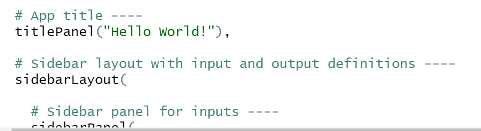
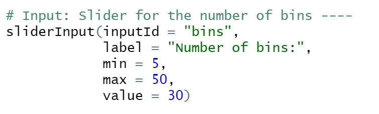
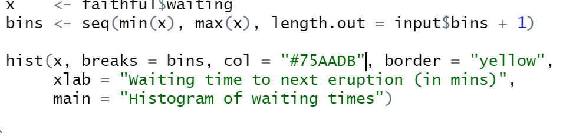
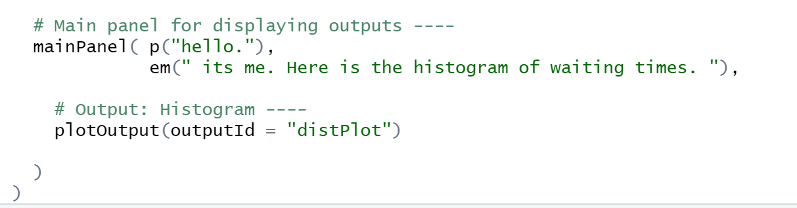
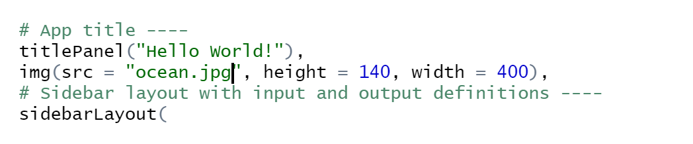
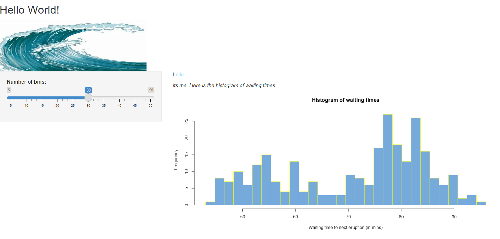

```{r setup, include=FALSE}
knitr::opts_chunk$set(echo = TRUE)
```


```{r}
#install.packages('shiny')
library(shiny)
```


```{r echo=TRUE}
#runExample('01_hello')
```


```{r, out.height= "350px",out.width= "800px",echo=TRUE,eval=TRUE,fig.cap="Replace text here with the caption"}
knitr::include_graphics("C:/Users/chloe/OneDrive/Documents/Nm2207/Week 8/app/picture.jpeg")

```

```{r, out.height= "350px",out.width= "800px",echo=TRUE,eval=TRUE,fig.cap="Replace text here with the caption"}


```

```{r, out.height= "350px",out.width= "800px",echo=TRUE,eval=TRUE,fig.cap="Replace text here with the caption"}

```

```{r, out.height= "350px",out.width= "800px",echo=TRUE,eval=TRUE,fig.cap="Replace text here with the caption"}


```

```{r, out.height= "350px",out.width= "800px",echo=TRUE,eval=TRUE,fig.cap="Replace text here with the caption"}





```

